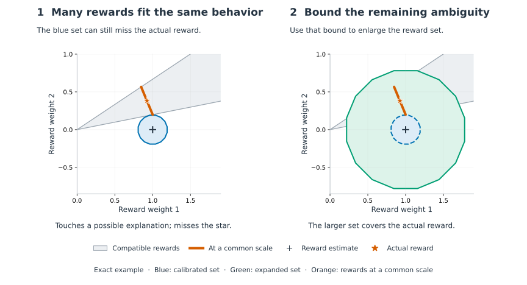
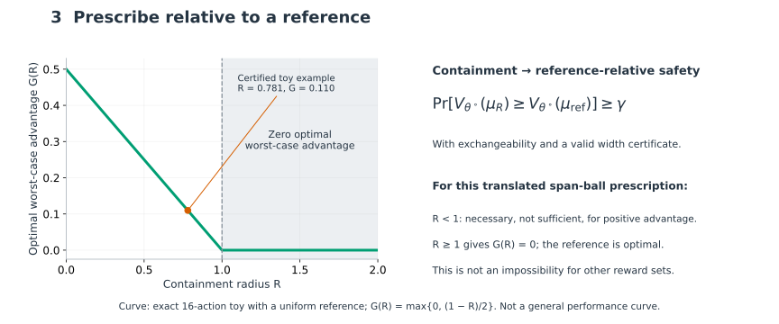

<div align="center">

# CP-IRL

**Calibrating What Behavior Can Identify**

*Conformal Reward Sets for Inverse Reinforcement Learning*

[](LICENSE)
[](#environment)
[](paper/main.pdf)
[](https://chi-shan0707.github.io/cp-irl/)

[Paper (PDF)](paper/main.pdf) &nbsp;·&nbsp;
[Math walkthrough](math_summary.html) &nbsp;·&nbsp;
[Project page](https://chi-shan0707.github.io/cp-irl/) &nbsp;·&nbsp;
[Citation](#citation) &nbsp;·&nbsp;
[License](#license)

</div>

---

**Yuhan Chi** · School of Mathematical Sciences, Fudan University
<yhchi25@m.fudan.edu.cn>

Accepted as a **poster** at the NeurIPS 2026 workshop
[PUDM](https://sites.google.com/view/neurips-2026-workshop-pudm) —
*Physical Understanding for Decision-Making: Bridging Foundation Models and
Reliable Agents*, Sydney, 11–12 December 2026.

**Version note (6 October 2026):** the [current PDF](paper/main.pdf) is a dated
post-acceptance author revision, with attribution/scope clarifications and a
small exact-cone diagnostic in Appendix D. The [accepted submission](paper/main_full9_revised.pdf)
is preserved unchanged. The new experiment was not part of the reviewed paper;
see the [detailed change record](paper/POST_ACCEPTANCE_CHANGES.md).

## What does this paper do?

**Many rewards can explain the same behavior. Which ones must we account for
before choosing a policy safely?**

Inverse reinforcement learning infers what someone values from their behavior.
But the same route, for example, could reflect a preference for speed, safety,
or comfort. A set containing one plausible explanation may still miss the
reward the person actually uses.

Building on conformal prediction, IRL, and conformal inverse optimization (CIO),
we use held-out behavior to choose the size of a reward set. This paper develops
a calibration score based on how reward differences affect
policy values. It then asks what additional bound on reward ambiguity is needed
to cover the actual reward—and when that coverage supports a policy that is no
worse than a chosen baseline. CIO already introduces calibration and an
inverse-set diameter assumption; our contribution adapts these ideas to IRL's
reward geometry and analyzes their consequences.

## The idea in two pictures



**Read the star first: it is the demonstrator's actual reward.** Every reward in
the gray region explains the same behavior. The blue set reaches that region,
yet misses the star. The orange segment puts compatible rewards at a common
scale. A proven bound on their spread tells us how far to expand the set; the
green set now covers the star.



**Covering more rewards makes protection easier, but improvement harder.** We
compare against a baseline—a policy we could keep using—and choose a policy
that maximizes its worst-case gain over that baseline across the reward set. When the actual reward is covered, the policy is no worse than
that baseline. A very large set can leave no provable improvement, making the
baseline optimal. The curve illustrates one exact small example.

<details>
<summary>Precise guarantee and assumptions</summary>

The nearest-cone LP score calibrates **intersection** with the compatible reward
set. A certified unit-span diameter η gives the **containment** radius
`R = min{2, 2q + η}`. Under a shared known MDP, fully observed exact-optimal
policies, nonnull rewards and center, exchangeable calibration, and a valid width
bound, the normalized actual reward is covered with marginal probability at
least γ. That probability averages over calibration samples and a new
demonstrator; it is not conditional coverage for each person or fitted set.

“Safe” means no worse than the reference in expected discounted reward. It does
not guarantee that every trajectory avoids harm. For this ball-based rule,
`R ≥ 1` gives zero optimal worst-case gain; `R < 1` is necessary, not sufficient,
for a positive gain. At `R > 1` every optimum is feature-equivalent to the
reference; at `R = 1` other optima may tie.

The figures use Appendix D's exact 16-action geometry, with coordinates
`w = 2θ/(1−β)` and span norm `max_j p_jᵀw`. The example-specific decision curve is
`G(R) = max{0, (1−R)/2}` for a uniform reference. These explanatory figures were
added after acceptance. [Geometry PDF](paper/figures/core_geometry.pdf) ·
[Decision PDF](paper/figures/core_prescription.pdf) ·
[Reproduce with `make overview`](paper/make_core_figures.py).

</details>

## What did we find?

- **Measure reward differences through decisions.** Our score is invariant to
  feature reparameterization and computable by a linear program. In the original
  coordinate-change experiment, the angular radius shifts by 24° on average at
  κ = 200; the span radius changes by at most 2×10⁻⁸.
- **A plausible explanation need not be the actual reward.** At an 80% target,
  the original experiment gets about 82% intersection coverage but only 44%
  coverage of the normalized actual reward at the same radius.
- **A valid guarantee can still be too conservative.** With the universal
  ambiguity bound η = 2, the certified rule returns the baseline and loses to
  the point estimate in all six original comparisons.
- **An exact small example supports a positive guarantee.** The separately
  labelled post-acceptance supplement gets η = 0.397825, R = 0.780508 and
  worst-case gain 0.109746 over a uniform baseline. This demonstrates a useful
  certificate in one case; it does not establish general performance gains.

## What's here

- tabular MDP, gridworld, and Objectworld environments
- classical, maximum-entropy, and Bayesian IRL estimators
- Bellman-resolvent feasible-reward sets and the span-seminorm conformal score
- intrinsic reward-ray normalization and the two-stage `q, η → R` bridge
- an occupancy-measure solver for robust MDPs with reward ambiguity
- the three experiment scripts behind the paper's numbers, with their recorded
  JSON outputs; superseded probes and ablations are in `experiments/legacy/`
- the dated author revision, its figure sources, and the unchanged accepted submission
- a small exact-cone supplement, runnable with `make toy`, with recorded results

## Paper

| File | What it is |
|---|---|
| [`paper/main.pdf`](paper/main.pdf) | post-acceptance author revision, built by `make paper` |
| `paper/main.tex` | dated revised source: `[sglblindworkshop, final]`, named author |
| `paper/main_full9_revised.tex` | the submitted double-blind version, unchanged; its PDF is byte-identical to the one on OpenReview |
| [`paper/ERRATA.md`](paper/ERRATA.md) | September camera-ready corrections and revision history |
| [`paper/POST_ACCEPTANCE_CHANGES.md`](paper/POST_ACCEPTANCE_CHANGES.md) | October changes, artifact hashes, new experiment and its limits |
| [`paper/PROVENANCE.md`](paper/PROVENANCE.md) | which script and recorded file each number in the paper comes from |
| `paper/archive/` | the 19 August draft (source and PDF), plus the figures and figure scripts of an earlier draft, kept for provenance |
| [`math_summary.html`](math_summary.html) | a guided walk through the geometry, with proofs |

A math walkthrough of the core theory — the seminorm, the two events, the
`q → R` bridge, and the degeneracy threshold — is at
[`math_summary.html`](math_summary.html).

## Environment

The implementation uses Python 3.10 with NumPy, SciPy, and CVXPY. Install the
tested dependency ranges with:

```bash
python -m pip install -r requirements.txt
```

Common tasks, via the Makefile (`make help` lists them all):

```bash
make paper        # build paper/main.pdf (4-pass, runs bibtex)
make test         # unit tests, including the exact-cone supplement
make figures      # redraw both figures from the recorded JSONs
make verify       # re-check the identities listed in App. C numerically
make experiments  # rerun the three scripts behind the paper's numbers (hours)
make toy          # small post-acceptance exact-cone diagnostic
```

## Repository layout

| Path            | Contents                                             |
|-----------------|-------------------------------------------------------|
| `envs/`         | tabular MDP, gridworld, Objectworld environments       |
| `cio/`          | conformal inverse optimization reference implementation |
| `irl/`          | inverse reinforcement learning estimators and feasible sets |
| `conformal/`    | calibration and concentration baselines                |
| `robust/`       | robust MDP optimization                                |
| `experiments/`  | experiment and ablation scripts                        |
| `tests/`        | environment tests                                       |
| `paper/`        | manuscript, bibliography, and figures                  |

## Scope

The implementation targets tabular MDPs with rewards linear in known features.
Strictly positive worst-case advantage under the ball-based prescription
requires `2q + η < 1`; this condition alone is not sufficient. The universal
`η = 2` bound is valid but forces reference-equivalent features. The supplement
computes a sharper certificate for one simple geometry; useful certificates
for general applications and the original benchmarks remain open.

## Citation

```bibtex
@inproceedings{chi2026cpirl,
  title     = {Calibrating What Behavior Can Identify:
               Conformal Reward Sets for Inverse Reinforcement Learning},
  author    = {Chi, Yuhan},
  booktitle = {Physical Understanding for Decision-Making:
               Bridging Foundation Models and Reliable Agents},
  series    = {NeurIPS 2026 Workshop},
  year      = {2026},
  note      = {Poster}
}
```

A machine-readable version is in
[`CITATION.cff`](CITATION.cff), which GitHub renders as a "Cite this
repository" button. Add a DOI once the workshop proceedings are posted.

## License

Code is released under the [MIT License](LICENSE). The paper text and figures
in `paper/` are © Yuhan Chi and are made available for reading and citation;
if you'd like to reuse figures or text beyond fair use/citation, please reach
out (yhchi25@m.fudan.edu.cn).
